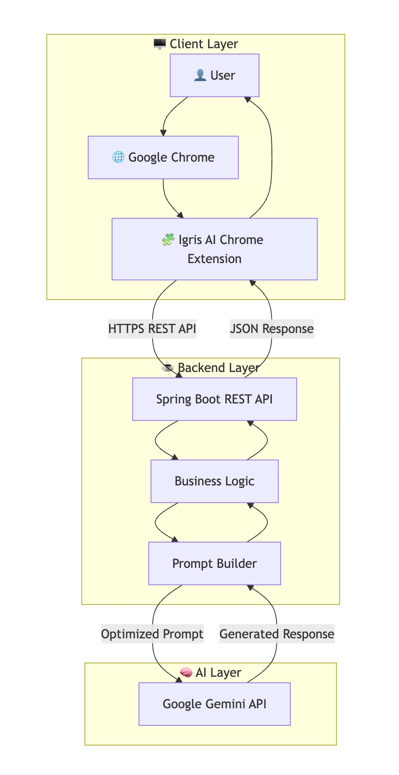
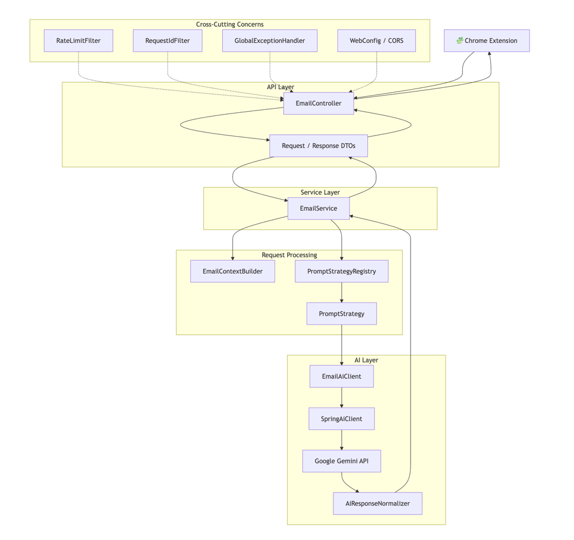
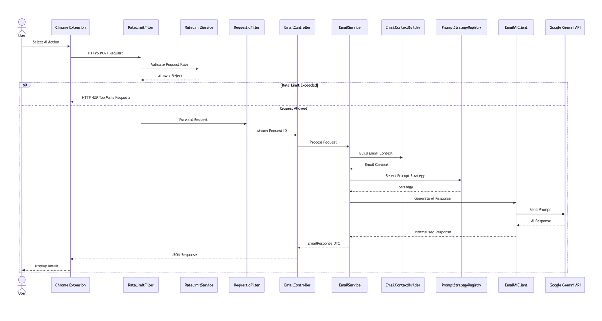
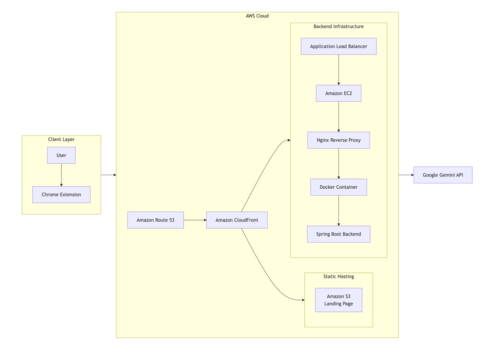
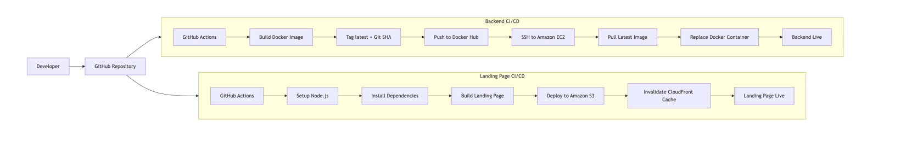

# Igris AI

> AI-powered Chrome Extension that helps you understand, summarize, and compose emails directly inside your Gmail.

<p align="center">
  <a href="https://igrisai.cloud"><strong>🌐 Website</strong></a> •
  <a href="https://drive.google.com/file/d/19Ru8BNK33kHOkvqHOlJNlRIhSJF7r-XO/view?usp=drivesdk"><strong>🎥 Demo</strong></a> •
</p>

<p align="center">


</p>

---

## 1 Table of Contents

- Project Overview
- Problem Statement
- Solution
- Features
- System Architecture
- Technology Stack
- Repository Structure
- Security
- Installation & Setup
- Key Learnings
- Author

## 2 Project Overview

**Igris AI** is an AI-powered Chrome Extension that transforms how users interact with emails by bringing intelligent assistance directly into Gmail. Instead of switching between email clients and external AI tools, users can summarize lengthy email threads, understand conversation context, generate professional replies, improve grammar, and adjust tone—all with a single click.

The platform combines a lightweight Chrome Extension with a production-grade Spring Boot backend deployed on Amazon Web Services (AWS). AI capabilities are powered by Google's Gemini API, enabling fast, context-aware, and high-quality responses while maintaining a seamless user experience.

Igris AI follows a **stateless architecture**, processing each request independently without persisting user emails, conversations, or AI-generated content in a database. This design simplifies the system architecture, enhances user privacy, and minimizes data exposure by ensuring that requests are processed only for the duration of each interaction.

Built using modern backend engineering and DevOps practices, Igris AI leverages Docker for containerization, GitHub Actions for automated CI/CD, and AWS cloud services—including Amazon EC2, Amazon S3, CloudFront, and Route 53—to deliver a secure, scalable, and production-ready application.

### Key Highlights

- AI-powered email generation, smart replies, summarization, grammar correction, and tone enhancement
- Seamless Gmail integration through a Chrome Extension (Manifest V3)
- Production-grade Spring Boot backend with strategy-based prompt generation
- Google Gemini 2.5 Flash integration for context-aware AI responses
- Stateless architecture with no database or persistent storage of user emails
- Cloud-native deployment on AWS using Amazon EC2, Amazon S3, CloudFront, and Route 53
- Containerized deployment with Docker and Nginx as a reverse proxy
- Independent CI/CD pipelines for the frontend and backend using GitHub Actions
- Secure credential management using GitHub Secrets and environment variables


## 3 Problem Statement

Modern email communication often requires users to summarize lengthy conversations, understand complex contexts, draft professional responses, and refine the tone or grammar of their messages. While general-purpose AI assistants can help with these tasks, they typically require users to manually copy and paste email content into external applications, disrupting workflow and reducing productivity.

Additionally, sharing sensitive or confidential email content with third-party AI platforms can raise privacy concerns, as users may be uncomfortable transmitting personal or business communications outside their email environment. This extra step not only impacts convenience but can also discourage the adoption of AI-assisted email workflows.

The challenge was to develop an AI-powered email assistant that integrates directly into Gmail, delivers high-quality contextual assistance without requiring users to switch applications, and follows a stateless architecture that processes requests in real time without storing user emails or conversation history in a database.


## 4 Solution

To address these challenges, I developed **Igris AI**, an AI-powered Chrome Extension that integrates directly into Gmail, enabling users to generate professional email replies, summarize lengthy conversations, improve grammar, and refine tone without leaving their inbox. By embedding AI capabilities directly into the email workflow, Igris AI eliminates the need to copy and paste email content into external AI applications, providing a faster and more seamless user experience.

The extension securely communicates with a Spring Boot backend through REST APIs. Upon receiving a request, the backend validates the input, constructs optimized prompts using a strategy-based prompt generation framework, and interacts with Google's Gemini API to produce context-aware responses. The generated output is then normalized and returned to the Chrome Extension for immediate display within the Gmail interface.

Igris AI follows a **stateless architecture**, processing each request independently without storing user emails, conversation history, or AI-generated responses in a database. This design minimizes persistent data exposure, enhances user privacy, and simplifies the overall system architecture while maintaining fast response times.

To ensure reliability, scalability, and maintainability, the application is deployed on AWS using a production-ready infrastructure. The landing page is hosted on **Amazon S3** and delivered globally through **Amazon CloudFront**, with **Amazon Route 53** providing DNS management. The backend is containerized using **Docker**, hosted on **Amazon EC2**, and served through **Nginx** as a reverse proxy. Independent **GitHub Actions** CI/CD pipelines automate the deployment of both the landing page and backend, enabling consistent and efficient production releases.


## 5. Features

### 5.1 AI-Powered Email Assistance

- Generate professional and context-aware email replies.
- Summarize lengthy email conversations into concise insights.
- Improve grammar and writing quality of email drafts.
- Adjust the tone of emails to match different communication styles.
- Generate subject lines for emails.
- Understand email thread context to produce relevant AI responses.

### 5.2 Chrome Extension Experience

- Native Gmail integration through a Chrome Extension (Manifest V3).
- AI assistance directly within the email compose and reply interface.
- One-click access to email generation and editing features.
- Eliminates the need to switch between Gmail and external AI platforms.
- Lightweight and responsive user experience.

### 5.3 Backend & AI Processing

- RESTful backend built with Spring Boot and Spring AI.
- Strategy-based prompt generation for different email operations.
- Context-aware integration with Google Gemini 2.5 Flash.
- Response normalization for consistent AI output.
- Request validation, centralized exception handling, and rate limiting.

### 5.4 Cloud & DevOps

- Production deployment on Amazon Web Services (AWS).
- Landing page hosted on Amazon S3 and delivered through CloudFront.
- Backend hosted on Amazon EC2 with Docker containerization.
- Nginx reverse proxy for efficient request routing.
- Independent CI/CD pipelines for the landing page and backend using GitHub Actions.

### 5.5 Security & Architecture

- Stateless architecture with no database or persistent storage of user emails.
- Secure communication over HTTPS.
- Environment-based configuration with GitHub Secrets.
- Reverse proxy architecture protecting backend services.
- Secure REST API communication between the Chrome Extension and backend.

## 6 System Architecture

Igris AI follows a layered architecture that separates the user interface, backend services, AI processing, and cloud infrastructure. This architecture enables seamless communication between the Chrome Extension, Spring Boot backend, and Google's Gemini API while ensuring scalability, maintainability, and production-ready deployment.

---

### 6.1 High-Level Design (HLD)

The High-Level Design illustrates the primary components of Igris AI and how they interact to process user requests. The Chrome Extension acts as the client interface, the Spring Boot application handles business logic and AI orchestration, and Google's Gemini API performs intelligent text generation.



#### Workflow

1. The user interacts with the **Igris AI Chrome Extension** directly from the browser.

2. When an AI feature such as email summarization or reply generation is requested, the extension sends the email content to the **Spring Boot REST API** over a secure HTTPS connection.

3. The backend validates the request, applies the necessary business rules, and prepares an optimized prompt for the AI model.

4. The Prompt Builder sends the processed prompt to the **Google Gemini API**, which generates a context-aware response.

5. The AI-generated response is returned to the backend, where it is processed and formatted into a structured JSON response.

6. The Chrome Extension receives the response and displays the generated summary or email reply directly within the user's inbox, providing a seamless user experience without requiring users to leave their email client.

### 6.2 Low-Level Design (LLD)

The Low-Level Design illustrates the internal architecture of the Igris AI backend and the flow of a request through its core components. It demonstrates how incoming API requests are validated, processed, transformed into AI prompts, sent to Google's Gemini API, and returned as structured responses. The design also highlights the use of design patterns, request processing pipelines, and cross-cutting concerns such as rate limiting, exception handling, request tracing, and CORS configuration to ensure a secure, maintainable, and scalable backend.



#### Workflow

1. The Chrome Extension sends an email-processing request to the `EmailController`.

2. Incoming requests are validated and mapped into the appropriate Request DTOs.

3. The `EmailService` orchestrates the complete processing workflow.

4. `EmailContextBuilder` extracts and prepares the email context required for AI processing.

5. Based on the requested operation (Reply, Summarize, Improve, Grammar Fix, Subject Generation, or Tone Change), the `PromptStrategyRegistry` selects the appropriate `PromptStrategy` implementation.

6. The generated prompt is forwarded to the `EmailAiClient`, which delegates the request to the `SpringAiClient` for communication with Google's Gemini API.

7. After receiving the AI-generated response, the `AiResponseNormalizer` formats and cleans the output before returning it to the service layer.

8. The response is converted into a structured `EmailResponse` DTO and sent back to the Chrome Extension.

9. Throughout the request lifecycle, cross-cutting components such as rate limiting, request tracing, CORS configuration, and global exception handling ensure secure, reliable, and observable request processing.

### 6.3 Request Flow

The Request Flow illustrates the complete lifecycle of an AI request within Igris AI, from the moment a user initiates an action in the Chrome Extension to the delivery of the AI-generated response. It demonstrates how incoming requests pass through security and observability filters, are processed by the backend, transformed into optimized prompts, sent to Google's Gemini API, and returned as structured responses. This sequence highlights the interaction between the extension, backend services, AI components, and cross-cutting infrastructure to ensure secure, reliable, and efficient request processing.



#### Workflow

1. The user selects an AI feature (such as **Reply**, **Summarize**, **Improve**, **Grammar Fix**, **Subject Generation**, or **Tone Change**) from the Igris AI Chrome Extension.

2. The extension sends a secure HTTPS POST request to the Spring Boot backend.

3. The request first passes through the `RateLimitFilter`, which consults the `RateLimitService` to verify whether the client has exceeded the configured request limit. If the limit is exceeded, the backend immediately returns an **HTTP 429 (Too Many Requests)** response.

4. If the request is allowed, the `RequestIdFilter` assigns a unique request identifier to improve request tracing and observability throughout the processing pipeline.

5. The `EmailController` receives the request and forwards it to the `EmailService` for orchestration.

6. The `EmailContextBuilder` extracts and prepares the email context required for AI processing.

7. Based on the requested operation, the `PromptStrategyRegistry` selects the appropriate `PromptStrategy` implementation to generate an optimized prompt.

8. The generated prompt is sent to the `EmailAiClient`, which delegates the request to the `SpringAiClient` for communication with Google's Gemini API.

9. Gemini generates the requested content and returns the response to the backend, where the `AiResponseNormalizer` cleans and formats the output before it is converted into an `EmailResponse` DTO.

10. The `EmailController` returns the structured JSON response to the Chrome Extension, which displays the AI-generated content directly within the user's email interface.

### 6.4 AWS Deployment Architecture

The AWS Deployment Architecture illustrates how Igris AI is hosted and delivered in a production environment. It demonstrates the complete infrastructure responsible for routing user requests, serving the landing page, hosting the backend application, and securely communicating with Google's Gemini API. By leveraging AWS services alongside containerization and reverse proxying, the deployment ensures high availability, scalability, maintainability, and efficient request handling.



#### Workflow

1. Users access Igris AI through its custom domain, which is managed by **Amazon Route 53**.

2. **Amazon CloudFront** receives incoming requests and acts as the content delivery network (CDN), reducing latency and improving response times.

3. Requests for the landing page and other static assets are served directly from **Amazon S3** through CloudFront.

4. API requests are forwarded by CloudFront to the **Application Load Balancer (ALB)**.

5. The ALB routes incoming traffic to the appropriate **Amazon EC2** instance hosting the backend application.

6. **Nginx** running on the EC2 instance acts as a reverse proxy, handling incoming HTTP requests and forwarding them to the Dockerized application.

7. The **Spring Boot** backend executes the requested business logic and communicates with **Google's Gemini API** to generate AI-powered responses.

8. The generated response travels back through the same infrastructure (Spring Boot → Nginx → ALB → CloudFront) before being delivered securely to the Chrome Extension.

### 6.5 CI/CD Pipeline

Igris AI employs two independent CI/CD pipelines to automate the deployment of its frontend and backend components. GitHub Actions monitors changes within each module and triggers the appropriate workflow based on the modified files. The landing page is built and deployed to Amazon S3 with automatic CloudFront cache invalidation, while the backend is containerized, published to Docker Hub, and deployed to the production EC2 instance via SSH. This separation ensures faster deployments, improved maintainability, and independent release cycles for each application component.



#### Workflow

##### Landing Page Deployment

1. Changes pushed to the `igris-landing` directory automatically trigger the landing page workflow.
2. GitHub Actions checks out the latest source code and sets up the Node.js environment.
3. Project dependencies are installed and the production build is generated.
4. The generated static files are synchronized with the Amazon S3 bucket.
5. After deployment, a CloudFront cache invalidation is triggered to ensure users receive the latest version of the landing page.

##### Backend Deployment

1. Changes pushed to the `igiris-backend` directory automatically trigger the backend workflow.
2. GitHub Actions builds a Docker image from the latest backend source code.
3. The image is tagged with both `latest` and a unique Git commit SHA before being pushed to Docker Hub.
4. Using a secure SSH connection, the production EC2 instance pulls the latest Docker image.
5. The existing backend container is stopped and removed.
6. A new container is started using the latest image with the required environment variables and restart policy.
7. Nginx continues acting as the reverse proxy, seamlessly forwarding requests to the newly deployed backend container.

## 7. Technology Stack

The Igris AI platform is built using a modern, cloud-native technology stack that combines a React-based landing page, a Chrome Extension client, a Spring Boot backend, Google's Gemini AI, containerization, AWS cloud services, and automated CI/CD pipelines.

| Category | Technologies |
|----------|--------------|
| **Frontend** | React, TypeScript, Vite, Tailwind CSS |
| **Browser Extension** | Chrome Extension (Manifest V3), JavaScript, HTML, CSS |
| **Backend** | Java 21, Spring Boot, Spring AI |
| **AI & LLM** | Google Gemini 2.5 Flash |
| **Build Tools** | Maven, npm |
| **Containerization** | Docker |
| **Reverse Proxy** | Nginx |
| **Cloud Services** | Amazon EC2, Amazon S3, Amazon CloudFront, Amazon Route 53 |
| **CI/CD** | GitHub Actions, Docker Hub |
| **Version Control** | Git, GitHub |

## 8. Repository Structure

Igris AI follows a monorepo architecture, where the landing page, backend service, Chrome Extension, and deployment workflows are maintained within a single repository. This organization enables independent development, testing, and deployment of each component while simplifying version control and collaboration.

```text
igris-ai/
│
├── igris-landing/          # React + TypeScript landing page
│
├── igiris-backend/         # Spring Boot backend
│   ├── src/
│   ├── Dockerfile
│   └── pom.xml
│
├── igris-extension/        # Chrome Extension (Manifest V3)
│
├── .github/
│   └── workflows/
│       ├── backend.yml
│       └── landing.yml
│
├── docs/                   # Documentation & architecture assets
│
├── README.md

```
### Repository Components

| Directory | Purpose |
|-----------|---------|
| `ai-extension/` | Chrome Extension (Manifest V3) that integrates with Gmail and provides AI-powered email assistance, including email generation, smart replies, grammar correction, tone enhancement, and summarization. |
| `igris-landing/` | React-based landing page built with TypeScript, Vite, and Tailwind CSS, serving as the public website for Igris AI. |
| `igiris-backend/` | Spring Boot backend that handles request processing, prompt engineering, AI orchestration, Google Gemini integration, response normalization, and REST APIs. |
| `.github/workflows/` | GitHub Actions workflows that automate CI/CD for both the landing page (Amazon S3 + CloudFront) and backend (Docker Hub + Amazon EC2). |
| `docs/` | Stores project documentation, architecture diagrams, screenshots, and other assets referenced throughout the repository. |

## 9. Security

Security is a core consideration in the design and deployment of Igris AI. The application follows industry best practices to protect sensitive credentials, secure communication channels, and safeguard user data. By adopting a stateless architecture, secure deployment practices, and robust request handling mechanisms, Igris AI provides a reliable and privacy-conscious AI-powered email experience.

### Security Measures

| Area | Implementation |
|------|----------------|
| **Stateless Architecture** | User emails, conversation history, and AI-generated responses are processed in real time without being stored in a database. |
| **Secrets Management** | API keys, AWS credentials, Docker Hub credentials, and SSH keys are securely managed using GitHub Secrets and injected during deployment. |
| **API Key Protection** | Google Gemini API keys are stored as environment variables and are never exposed to the client application. |
| **Rate Limiting** | Custom request rate limiting protects the backend from excessive requests and potential abuse. |
| **Secure Communication** | All communication between the Chrome Extension, backend services, and Google Gemini is encrypted using HTTPS. |
| **Request Validation** | Incoming requests are validated before processing to ensure data integrity and reduce invalid API calls. |
| **Exception Handling** | Centralized exception handling prevents internal implementation details from being exposed to clients. |
| **Containerized Deployment** | The backend runs inside an isolated Docker container, ensuring consistent and secure application deployment. |
| **Reverse Proxy** | Nginx acts as a reverse proxy, routing requests to the backend while abstracting the application server from direct public access. |

### Security Highlights

- Stateless architecture with no persistent storage of user emails or AI-generated content.
- Secure credential management using GitHub Secrets and environment variables.
- HTTPS-encrypted communication across all system components.
- Built-in request validation and rate limiting to enhance API security.
- Containerized deployment with Docker and Nginx reverse proxy for a secure production environment.

# 10. Installation & Setup

This section provides the steps required to set up and run Igris AI in a local development environment. The project consists of three independent modules: the Spring Boot backend, the React-based landing page, and the Chrome Extension. Follow the instructions below to configure and launch each component successfully.

### 10.1 Prerequisites

Ensure the following software is installed before setting up the project:

| Software | Version |
|----------|---------|
| Java | 21 or later |
| Maven | 3.9+ |
| Node.js | 20+ (or the version required by your project) |
| npm | Latest |
| Docker | Latest |
| Git | Latest |
| Google Chrome | Latest |

### 10.2 Clone the Repository

```bash
git clone https://github.com/bhargavchandra06/igris-ai-email-assistant.git

cd igris-ai
```
### 10.3 Backend Setup

Navigate to the backend module:

```bash
cd igiris-backend
```

Install dependencies and build the project:

```bash
./mvnw clean install
```

Run the Spring Boot application:

```bash
./mvnw spring-boot:run
```

The backend will be available at:

```
http://localhost:8080
```

### 10.4 Landing Page Setup

Navigate to the landing page module:

```bash
cd igris-landing
```

Install dependencies:

```bash
npm install
```

Start the development server:

```bash
npm run dev
```

The landing page will be available at:

```
http://localhost:5173
```

### 10.5 Chrome Extension Setup

1. Open **Google Chrome**.
2. Navigate to **chrome://extensions**.
3. Enable **Developer Mode**.
4. Click **Load unpacked**.
5. Select the `ai-extension/extension` directory.
6. Pin the extension from the Chrome toolbar.
7. Open Gmail to start using Igris AI.

### 10.6 Environment Variables

The backend requires the following environment variables:

| Variable | Description |
|----------|-------------|
| `GEMINI_API_KEY` | Google Gemini API key |

### 10.7 Running the Application

To use Igris AI locally:

1. Start the Spring Boot backend.
2. Start the landing page development server (optional).
3. Load the Chrome Extension in Developer Mode.
4. Open Gmail.
5. Compose or reply to an email.
6. Use Igris AI features such as email generation, smart replies, grammar correction, tone enhancement, or summarization.

## 11. Key Learnings

Building Igris AI provided hands-on experience in designing, developing, and deploying a production-ready AI application. Some of the key learnings include:

- Designing scalable REST APIs using Spring Boot.
- Integrating Large Language Models using Spring AI and Google Gemini.
- Applying design patterns to create a modular and extensible backend architecture.
- Building and deploying Dockerized applications on AWS.
- Configuring production infrastructure using Amazon EC2, Amazon S3, CloudFront, and Route 53.
- Implementing automated CI/CD pipelines with GitHub Actions.
- Developing Chrome Extensions using Manifest V3.
- Applying secure software development practices through environment variables, GitHub Secrets, and stateless application design.


## 12. Future Enhancements

Potential improvements planned for future releases include:

- Support for multiple AI providers.
- Personalized writing styles and custom prompt templates.
- Multi-language email generation and translation.
- Calendar and meeting assistance.
- Enterprise authentication and workspace integration.
- AI-powered email categorization and prioritization.
- Analytics dashboard for usage insights.

## 14. Author

**G. Bhargav Chandra**

Final-year B.Tech student specializing in Computer Science and Business Systems, passionate about Backend Development, Cloud Computing, Artificial Intelligence, and DevOps.

