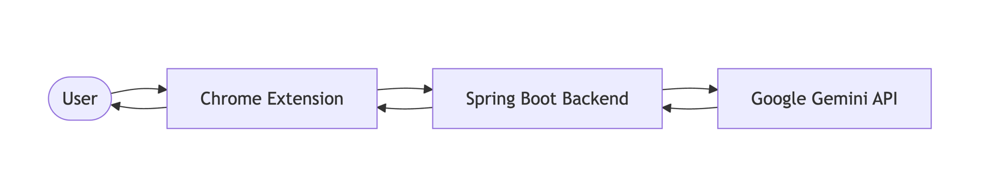

# Igris AI

> AI-powered Chrome Extension that helps you understand, summarize, and compose emails directly inside your Gmail.

  <a href="https://igrisai.cloud"><strong>🌐 Website</strong></a> •
  <a href="YOUR_DEMO_LINK"><strong>🎥 Demo</strong></a> •

---

## 📑 Table of Contents

- Project Overview
- Demo
- Problem Statement
- Solution
- Features
- System Architecture
- Technology Stack
- Repository Structure
- Security
- Installation & Setup
- Key Learnings
- Author

## 📖 Project Overview

**Igris AI** is an AI-powered Chrome extension that transforms how users interact with emails by bringing intelligent assistance directly into their inbox. Instead of switching between email clients and external AI tools, users can summarize lengthy conversations, understand email context, and generate professional replies with a single click.

The system combines a lightweight Chrome Extension with a production-grade Spring Boot backend deployed on AWS. AI capabilities are powered by Google's Gemini API, enabling fast and context-aware responses while maintaining a seamless user experience.

Built using modern backend development and DevOps practices, Igris AI features containerized deployment with Docker, automated CI/CD using GitHub Actions, and cloud infrastructure powered by Amazon Web Services to deliver a reliable and scalable application.

### Key Highlights

- 🤖 AI-powered email summarization and reply generation
- 🌐 Chrome Extension for seamless in-browser experience
- ☕ Spring Boot REST API backend
- 🧠 Google Gemini integration for intelligent text generation
- ☁️ Production deployment on AWS (Route 53, CloudFront, S3, ALB, EC2)
- 🐳 Dockerized application with Nginx reverse proxy
- 🚀 Automated CI/CD pipeline using GitHub Actions

## 🎯 Problem Statement

Email remains one of the primary communication channels for professionals, students, and businesses. However, managing long email threads, understanding conversation context, and drafting well-written replies can be time-consuming and repetitive.

Most users rely on external AI tools to summarize or generate responses, which requires copying email content, switching between applications, and pasting results back into their inbox. This interrupts workflow, increases context switching, and reduces productivity.

As the volume and complexity of emails continue to grow, there is a need for an integrated solution that provides intelligent assistance directly within the email interface, enabling users to understand conversations and compose responses without leaving their inbox.

## 💡 Solution

To address these challenges, I developed **Igris AI**, an AI-powered Chrome extension that integrates directly into the user's email workflow. Instead of relying on external AI platforms, users can access intelligent email assistance within their browser, eliminating unnecessary context switching.

The extension communicates with a Spring Boot backend through secure REST APIs. When a user requests an AI-generated response or summary, the backend processes the email content, constructs optimized prompts, and interacts with Google's Gemini API to generate context-aware results. The generated response is then returned to the extension and presented within the email interface.

To ensure reliability and scalability, the application is deployed on AWS using a production-ready infrastructure that includes Route 53 for DNS management, CloudFront and Amazon S3 for static content delivery, an Application Load Balancer for traffic distribution, Amazon EC2 for application hosting, Docker for containerization, Nginx as a reverse proxy, and GitHub Actions for automated CI/CD.

## ✨ Features

### 🤖 AI-Powered Email Assistance

- Generate professional and context-aware email replies.
- Summarize lengthy email conversations into concise insights.
- Understand the context of email threads for better decision-making.
- Generate responses directly within the browser without leaving the inbox.

### 🌐 Chrome Extension Experience

- Seamless integration with the browser.
- Lightweight and responsive user interface.
- One-click access to AI-powered email assistance.
- Eliminates the need to switch between multiple applications.

### ⚙️ Backend & API

- RESTful backend built with Spring Boot.
- Secure communication between the extension and backend.
- Optimized prompt generation for accurate AI responses.
- Robust error handling and request validation.

### ☁️ Cloud & DevOps

- Production deployment on AWS.
- Dockerized backend for consistent deployments.
- Nginx reverse proxy for efficient request routing.
- Automated CI/CD pipeline using GitHub Actions.
- Static website delivery through Amazon S3 and CloudFront.

### 🔒 Security

- HTTPS-enabled communication.
- Secure environment variable management.
- Domain management using Amazon Route 53.
- Reverse proxy architecture to protect backend services.

## 🏗️ System Architecture

Igris AI follows a layered architecture that separates the user interface, backend services, AI processing, and cloud infrastructure. This architecture enables seamless communication between the Chrome Extension, Spring Boot backend, and Google's Gemini API while ensuring scalability, maintainability, and production-ready deployment.

---

### 6.1 High-Level Design (HLD)

The High-Level Design illustrates the primary components of Igris AI and how they interact to process user requests. The Chrome Extension acts as the client interface, the Spring Boot application handles business logic and AI orchestration, and Google's Gemini API performs intelligent text generation.

#### Workflow

1. The user interacts with the Chrome Extension inside the browser.
2. The extension sends the email content to the Spring Boot backend through REST APIs.
3. The backend validates the request and prepares an optimized prompt.
4. The backend communicates with Google's Gemini API to generate AI-powered responses.
5. The generated result is returned to the backend.
6. The backend sends the response back to the Chrome Extension.
7. The extension displays the AI-generated content directly within the user's email interface.